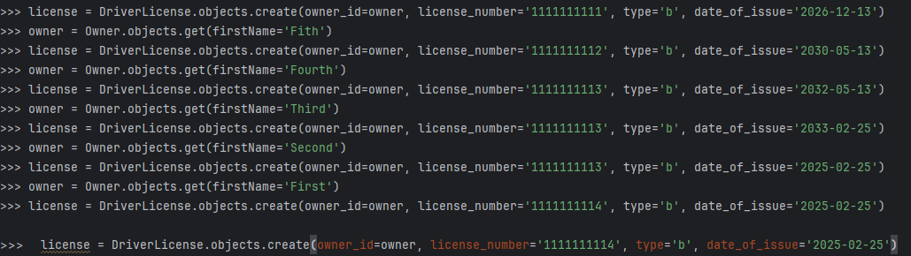
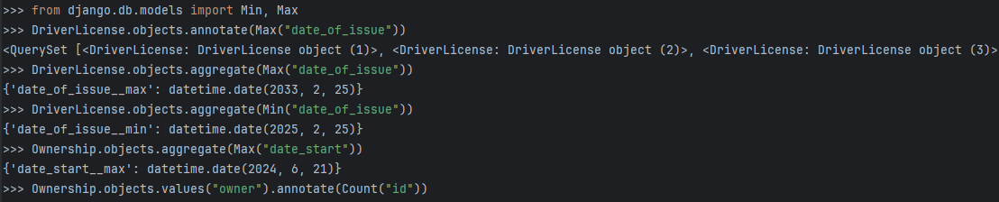
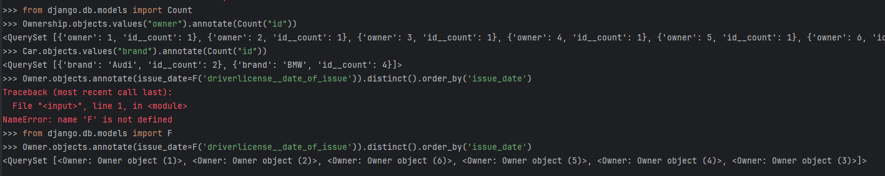

# Практическое задание 3.1

## Задание 1

Напишите запрос на создание 6-7 новых автовладельцев и 5-6 автомобилей, каждому автовладельцу назначьте удостоверение и от 1 до 3 автомобилей. Задание можете выполнить либо в интерактивном режиме интерпретатора, либо в отдельном python-файле. Результатом должны стать запросы и отображение созданных объектов. 

```python
from project_second_app.models import *
car = Car.objects.create(state_number='A000AA199', brand='BMW', model='X5')
car = Car.objects.create(state_number='A001AA199', brand='BMW', model='X4')
car = Car.objects.create(state_number='A000AA198', brand='BMW', model='X5')
car = Car.objects.create(state_number='A004AA197', brand='BMW', model='M5')
car = Car.objects.create(state_number='A006AA197', brand='Audi', model='A80')
car = Car.objects.create(state_number='A007AA197', brand='Audi', model='S6')
owner = Owner.objects.create(firstName="First", lastName="Firstov")
owner = Owner.objects.create(firstName="Second", lastName="Seconod")
owner = Owner.objects.create(firstName="Third", lastName="Thirdov")
owner = Owner.objects.create(firstName="Fourth", lastName="Fourthov")
owner = Owner.objects.create(firstName="Fith", lastName="Fithov")
owner = Owner.objects.create(firstName="Sixth", lastName="Sixthov")
car = Car.objects.get(state_number='A000AA199')
owner = Owner.objects.get(firstName='First')
ownership = Ownership.objects.create(owner_id=owner, car_id=car, date_start='2023-11-06', date_end='2024-03-12')
owner = Owner.objects.get(firstName='Second')
car = Car.objects.get(state_number='A001AA199')
ownership = Ownership.objects.create(owner_id=owner, car_id=car, date_start='2023-12-06', date_end='2024-05-12')
car = Car.objects.get(state_number='A000AA198')
owner = Owner.objects.get(firstName='Third')
ownership = Ownership.objects.create(owner_id=owner, car_id=car, date_start='2024-01-15', date_end='2024-05-12')
car = Car.objects.get(state_number='A004AA197')
owner = Owner.objects.get(firstName='Fourth')
ownership = Ownership.objects.create(owner_id=owner, car_id=car, date_start='2024-03-15', date_end='2024-04-13')
car = Car.objects.get(state_number='A006AA197')
owner = Owner.objects.get(firstName='Fith')
ownership = Ownership.objects.create(owner_id=owner, car_id=car, date_start='2024-01-25')
car = Car.objects.get(state_number='A007AA197')
owner = Owner.objects.get(firstName='Sixth')
ownership = Ownership.objects.create(owner_id=owner, car_id=car, date_start='2024-06-21')

license = DriverLicense.objects.create(owner_id=owner, license_number='1111111111', type='b', date_of_issue='2026-12-13')
owner = Owner.objects.get(firstName='Fith')
license = DriverLicense.objects.create(owner_id=owner, license_number='1111111112', type='b', date_of_issue='2030-05-13')
owner = Owner.objects.get(firstName='Fourth')
license = DriverLicense.objects.create(owner_id=owner, license_number='1111111113', type='b', date_of_issue='2032-05-13')
owner = Owner.objects.get(firstName='Third')
license = DriverLicense.objects.create(owner_id=owner, license_number='1111111114', type='b', date_of_issue='2033-02-25')
owner = Owner.objects.get(firstName='Second')
license = DriverLicense.objects.create(owner_id=owner, license_number='1111111115', type='b', date_of_issue='2025-02-25')
owner = Owner.objects.get(firstName='First')
license = DriverLicense.objects.create(owner_id=owner, license_number='1111111116', type='b', date_of_issue='2025-02-25')
```

Результаты:



## Задание 2

По созданным в пр.1 данным написать следующие запросы на фильтрацию:

* Где это необходимо, добавьте related_name к полям модели
* Выведете все машины марки “Toyota” (или любой другой марки, которая у вас есть)
* Найти всех водителей с именем “Олег” (или любым другим именем на ваше усмотрение)
* Взяв любого случайного владельца получить его id, и по этому id получить экземпляр удостоверения в виде объекта модели (можно в 2 запроса)
* Вывести всех владельцев красных машин (или любого другого цвета, который у вас присутствует)
* Найти всех владельцев, чей год владения машиной начинается с 2010 (или любой другой год, который присутствует у вас в базе)

```python
Car.objects.filter(brand='BMW')
Owner.objects.filter(firstName='First')
owner_id = Owner.objects.get(firstName='First').id
license = DriverLicense.objects.get(owner_id=1)
owners = Owner.objects.filter(car_)
owners = Owner.objects.filter(owner_car__car__color__contains='Red')
owners = Owner.objects.filter(owner_car__date_start__contains='2024')
```
Результаты:

## Задание 3
* Вывод даты выдачи самого старшего водительского удостоверения
* Укажите самую позднюю дату владения машиной, имеющую какую-то из существующих моделей в вашей базе
* Выведите количество машин для каждого водителя
* Подсчитайте количество машин каждой марки
* Отсортируйте всех автовладельцев по дате выдачи удостоверения 

```python
DriverLicense.objects.aggregate(Min("date_of_issue"))
Ownership.objects.aggregate(Max("date_start"))
Ownership.objects.values("owner").annotate(Count("id"))
Car.objects.values("brand").annotate(Count("id"))
from django.db.models import F
Owner.objects.annotate(issue_date=F('driverlicense__date_of_issue')).distinct().order_by('issue_date')
```
Результаты:



